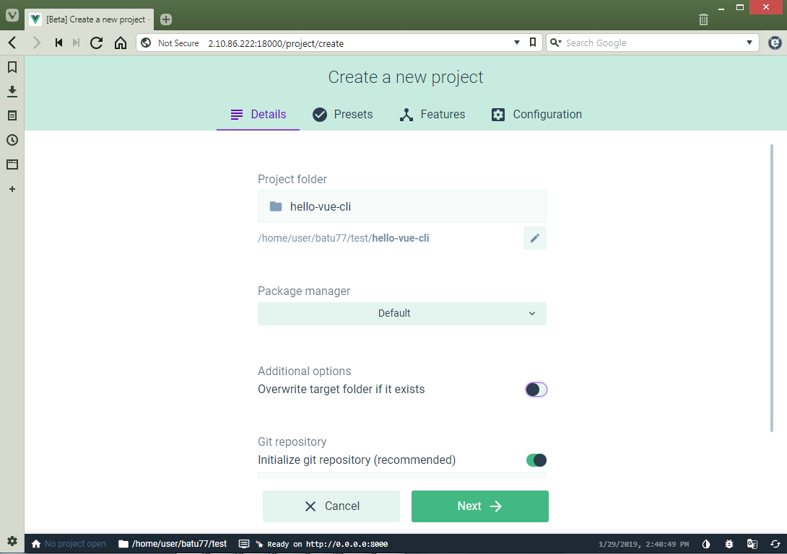
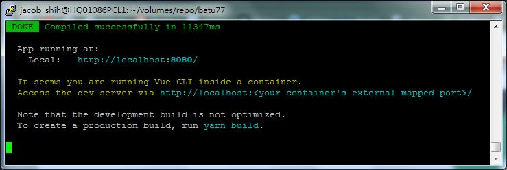
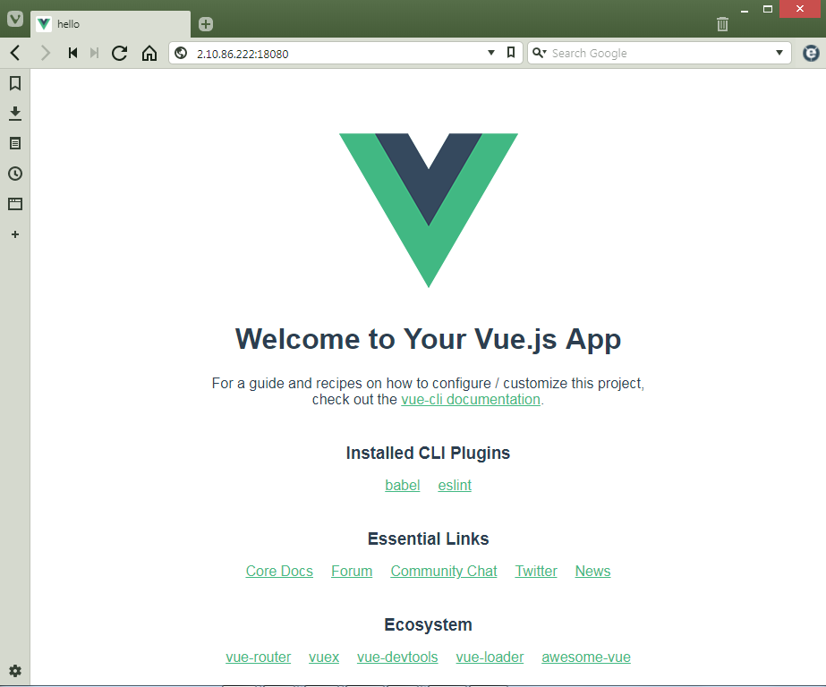

# dockvue

## overview

to create a docker image and container for developing responsive web ui with nodejs/npm/yarn/webpack/vue.js.

## deployment

* dockerfiles - folder contains dockerfiles to create docker image of dockvue.
* vuejs - notes for vue.js.

## development environment

### build and create a docker container

* dockerfile.

    [dockvue.dockerfile](./dockerfiles/dockvue.dockerfile)

* docker-compose.yml

    [docker-compose.yml](./docker-compose.yml)

* build the image.

    - export user and group id first.

    ```
    export UID=`id -u $USER`
    export GID=`id -g $USER`
    ```

    - build the image.

    ```
    docker-compose build
    ```

    - create and start the container in background.
    
    ```
    docker-compose up -d
    ```

* enter the container.

    ```
    docker exec -it dockvue sh
    ```

* stop and remove the container.

    ```
    docker-compose down
    ```

## hello vue.js

### create project with vue-cli

```
mkdir test
cd test
```

- create vue project

    ```
    vue create hello
    ```

- default preset

    ```
    Vue CLI v3.3.0
    ? Please pick a preset: (Use arrow keys)
    ? default (babel, eslint)
      Manually select features
    ```

- use yarn package manager

    ```
    Vue CLI v3.3.0
    ? Please pick a preset: default (babel, eslint)
    ? Pick the package manager to use when installing dependencies: (Use arrow keys)
    ? Use Yarn
      Use NPM
    ```

### create project visually with vue-cli ui tool

- start and open the vue-cli ui

    ```
    vue ui --host 0.0.0.0
    ```

- open vue gui on browser.

    

### run and test

- start the testing environment

    ```
    cd hello/
    yarn serve
    ```

- yarn serve

    

- open the browser and view the page.

    

